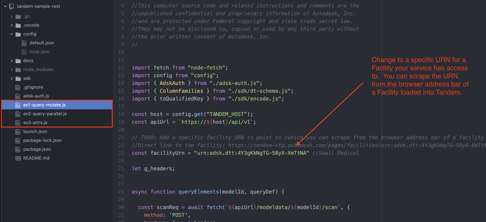

# Tandem REST Sample

## Overview

Example of query and update of model asset data. The output just goes to the Terminal window but similar code can be used to support something like Import/Export to another application such as Excel or Google Sheets.

*NOTE: The REST API that supports this sample is not yet official.  This app is not a complete description of the API and is evolving over time as the API evolves.  Any use of this API should be for prototype purposes only.*

## Pre-requisites

1. Install npm: https://www.npmjs.com
2. Make sure you have an account and access to at least one facility at https://tandem.autodesk.com (PRODUCTION) or https://tandem-stg.autodesk.com (STAGING).
3. Create a new Application on the Forge Developer Portal to get your Client_ID: https://forge.autodesk.com

## Setup and Configuration

1. After cloning this repo, run `npm install`.
2. Add your application Client_ID to the "User/Service" panel in Tandem. This authorizes our app to get read/write access to the specific Facility.

3. In the file `index.js`, add the URN of the Facility you used in Step 2.

4. Make a new config file by filling in the values in `config/default.json` and saving to `config/local.json`

## Run Examples

To run examples, run `node ex1-query-mutate.js` (adjust name of sample to run accordingly) from the Terminal command line. This will run the application in the node.js environment and return output to the Terminal window.

At this point, you should get something like the following image.

By default, the application is looking for a property named "Serial Number", which your Facility may not have set up.

## Modifying the App to look for specific property names

*NOTE: This sample is written to look for specific known properties associated with a known Facility Template.  It will not work out of the box for any Facility without some setup to apply that same Facility Template, or changing the code to look for properties that are known to your Facility.*

*This section will be updated with instructions on how to either apply the common Facility Template to your Facility, or to change the code appropriately. For now... you will have to see if you can hack your way through it, or if you have specific goal in mind, contact the Tandem Development team and we will try to help supply specific code*

